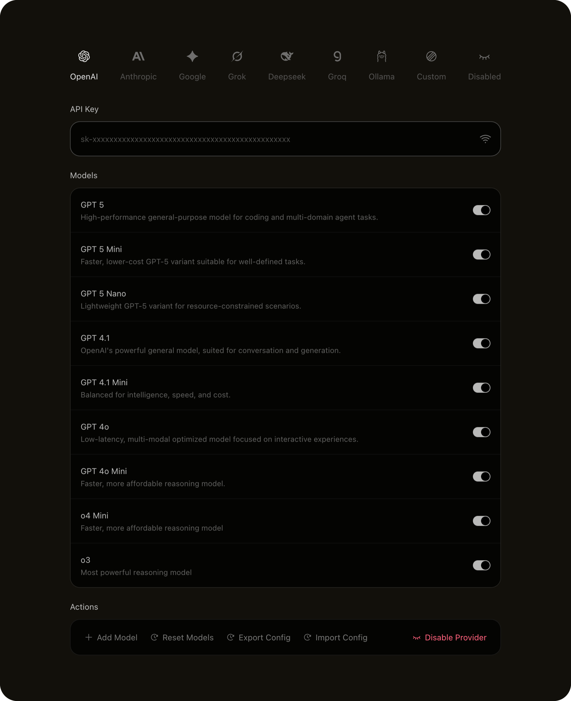
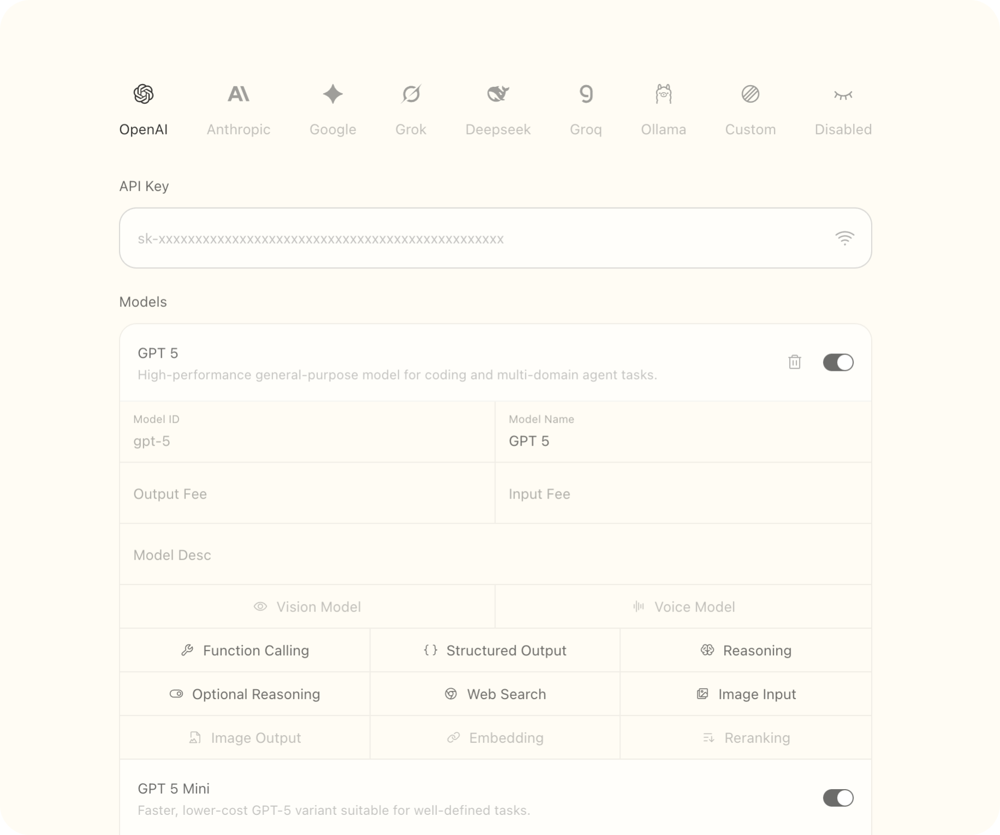
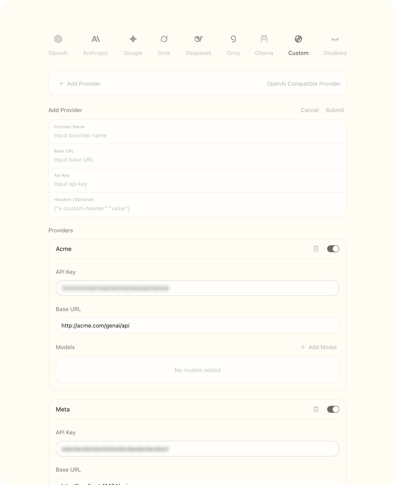
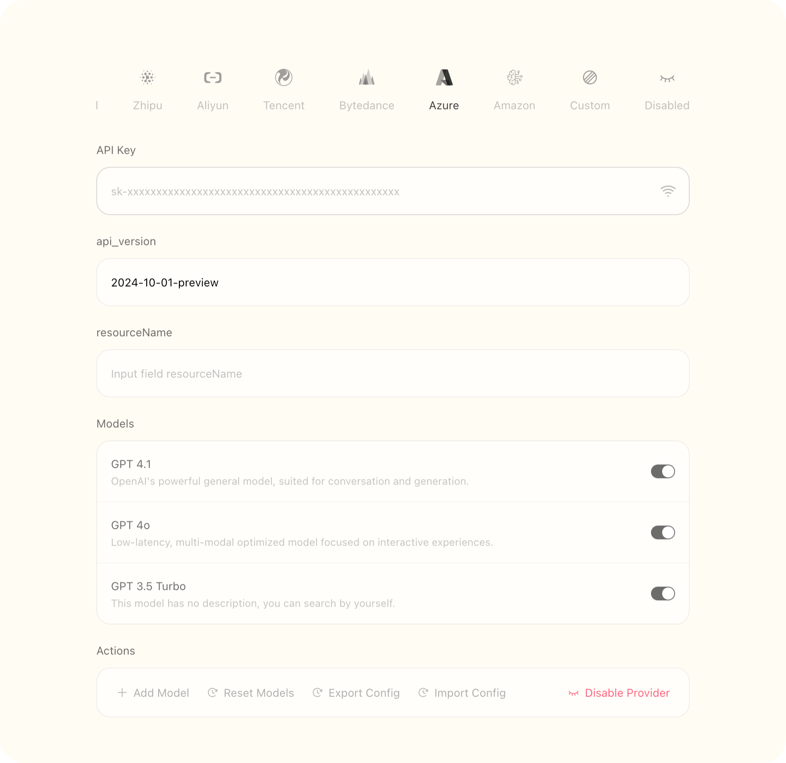

# AI SDK Panel

Still work in progress...

The config panel for AI SDK built with base-ui tailwind.css react-hook-form and valtio.


## Install

```bash
pnpm i @matrixages/ai-sdk-panel
```

## Features

- Dark mode



- Import and export config

- Edit model and provider



- Add custom providers



- Custom fields support



- Variant layout

## Props

## Providers

### Preset Providers

- openai
- anthropic
- google_gemini
- xai
- deepseek
- groq
- ollama

### All Providers

- openai
- anthropic
- google_gemini
- xai
- deepseek
- openrouter
- ollama
- cerebras
- cohere
- deepinfra
- fireworks
- groq
- lmstudio
- mistral
- perplexity
- siliconflow
- together
- vercel
- zhipu
- aliyun_bailian
- tencent_hunyuan
- volcengine
- azure_openai
- amazon_bedrock

## License

`ai-sdk-panel` using MIT license.
