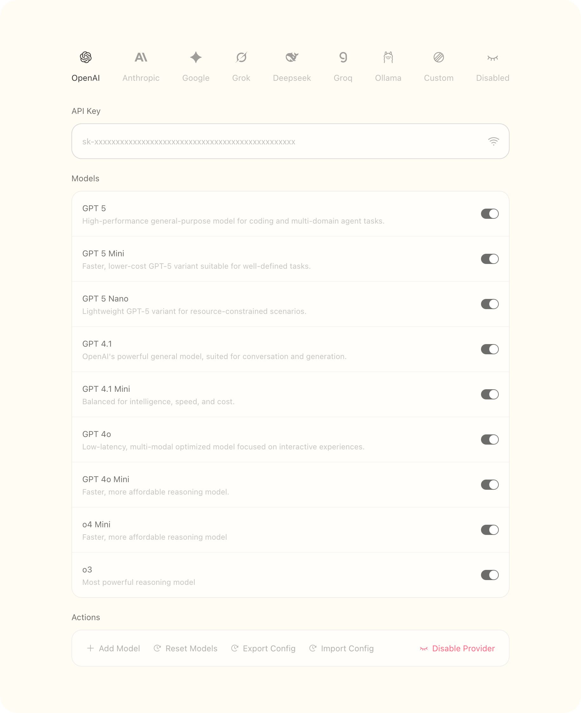

<p align="center">
  <a href="https://github.com/matrixages/ai-sdk-panel">
    <br>
  </a>
</p>

<h1 align="center">AI SDK Panel</h1>

<p align="center">The config panel for AI SDK built with base-ui tailwind.css react-hook-form and valtio.</p>

<p align="center">
 <a href="https://deepwiki.com/MatrixAges/ai-sdk-panel" target="_blank"></a>
  <a href="https://www.npmjs.com/package/@matrixages/ai-sdk-panel" target="_blank"></a>
  <a href="#"></a>
  <a href="#"></a>
</p>



## Install

```bash
pnpm i @matrixages/ai-sdk-panel
```

## How to use

You can know ai-sdk-panel in [Deepwiki](https://deepwiki.com/MatrixAges/ai-sdk-panel).

```tsx
const Page = () => {
	const props_providers: IPropsProviders = {
		config: { providers: preset_providers },
		tab: 'between',
		width: 690,
		onChange: v => {
			console.log(v)
		},
		onTest: useMemoizedFn(async () => {
			await sleep(500)

			return true
		})
	}

	return (
		<div
			className='
				flex justify-center
				w-screen min-h-screen
				py-20
				bg-amber-100/20
				dark:bg-amber-100/6
			'
		>
			<Providers {...props_providers} />
		</div>
	)
}
```

## Features

- 🌙 Dark mode
- 📥 Import and export config
- ✏️ Edit model and provider
- ⚙️ Custom providers
- 🎨 Custom locales
- 🎨 Custom icons
- ➕ Custom fields support
- 📐 Variant layout

## Props

```ts
export interface IPropsProviders {
	/* Provider config */
	config: {
		providers: Array<ConfigProvider>
		custom_providers?: Array<Provider>
	}
	/* Tab layout */
	tab: 'between' | 'scroll'
	/* Component width */
	width?: number | string
	/* I18n locales */
	locales?: Partial<ProvidersLocales>
	/* Custom provider icons, ExoticComponent is react fc component */
	icons?: Record<string, ExoticComponent>
	/* Trigger when config updated */
	onChange: (v: Config) => void
	/* Trigger when click API Key test button */
	onTest?: (provider: PresetProvider | SpecialProvider) => Promise<boolean>
}
```

```ts
export interface Provider {
	/* Provider name */
	name: string
	/* API key */
	api_key: string
	/* Request base url */
	base_url: string
	/* Enable provider, default is true */
	enabled: boolean
	/* Provider models */
	models: Array<Model>
	/* Custom request headers */
	headers?: string
}

/* Two provider: PresetProvider or SpecialProvider */
export type ConfigProvider = PresetProvider | SpecialProvider

/*  No base_url, provider supported by ai-sdk */
export interface PresetProvider extends Omit<Provider, 'base_url'> {
	api_key: string
	base_url?: string
}

/* Provider with custom fields */
export interface SpecialProvider extends Partial<Omit<Provider, 'name' | 'enabled'>> {
	name: string
	enabled: boolean
	custom_fields?: Record<string, string>
}

export interface Model {
	/* Model name */
	name: string
	/* Model unique id */
	id: string
	/* Enable model, default is true */
	enabled: boolean
	/* Model description */
	desc?: string
	/* Model features */
	features?: Features
	/* Model fee, input fee and output fee */
	fee?: { output?: number; input?: number }
}

export interface Features {
	/* Reasoning Model */
	reasoning?: boolean
	/* Vision model */
	vision?: boolean
	/* Voice(transcription) model */
	voice?: boolean
	/* Embedding Model */
	embedding?: boolean
	/* Reranking Model */
	reranking?: boolean

	/* Support switch reasoning */
	reasoning_optional?: boolean
	/* Support function calling */
	function_calling?: boolean
	/* Support structured output */
	structured_output?: boolean
	/* Support web search */
	web_search?: boolean
	/* Support input image */
	image_input?: boolean
	/* Support output image */
	image_output?: boolean
}
```

## Test as usage

Clone this repo, run commands:

- `pnpm i`
- `pnpm run test:ui`

All test case will be show in the test ui.

## Providers

### Preset Providers

- `OpenAI`
- `Anthropic`
- `Google Gemini`
- `Xai`
- `Deepseek`
- `Groq`
- `Ollama`

### All Providers

以下是您提供的名称，已将下划线替换为空格并大写开头：

- `OpenAI`
- `Anthropic`
- `Google Gemini`
- `Xai`
- `Deepseek`
- `Openrouter`
- `Ollama`
- `Cerebras`
- `Cohere`
- `Deepinfra`
- `Fireworks`
- `Groq`
- `Lmstudio`
- `Mistral`
- `Perplexity`
- `Siliconflow`
- `Together`
- `Vercel`
- `Zhipu`
- `Aliyun Bailian`
- `Tencent Hunyuan`
- `Volcengine`
- `Azure Openai`
- `Amazon Bedrock`

## License

`ai-sdk-panel` using MIT license.
